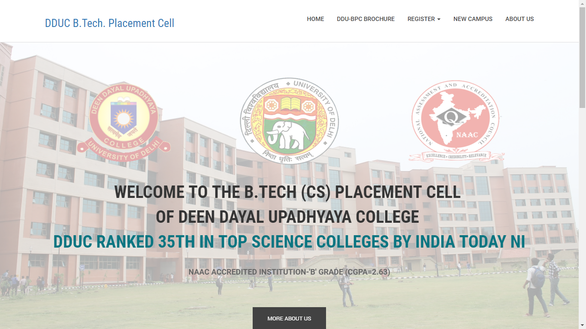
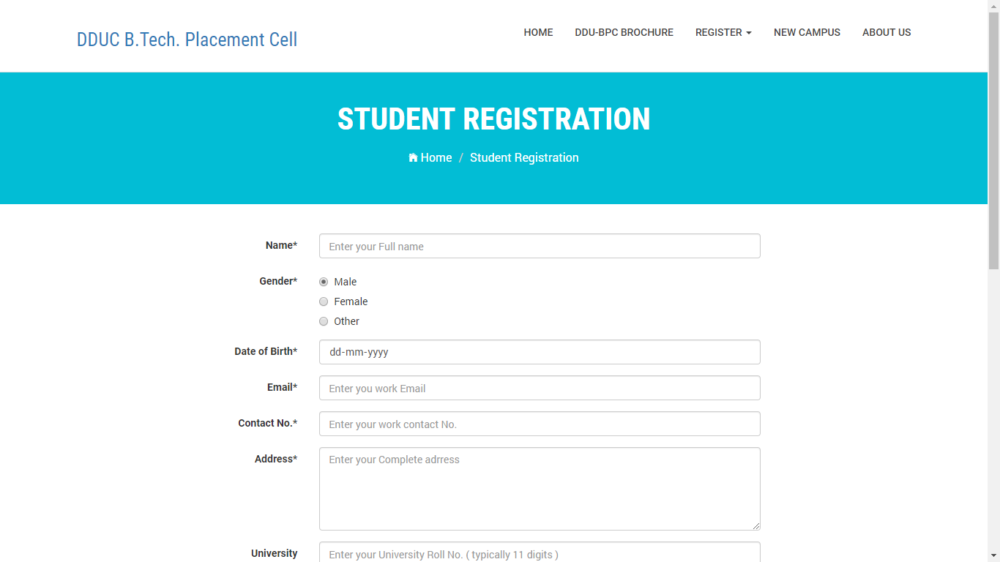
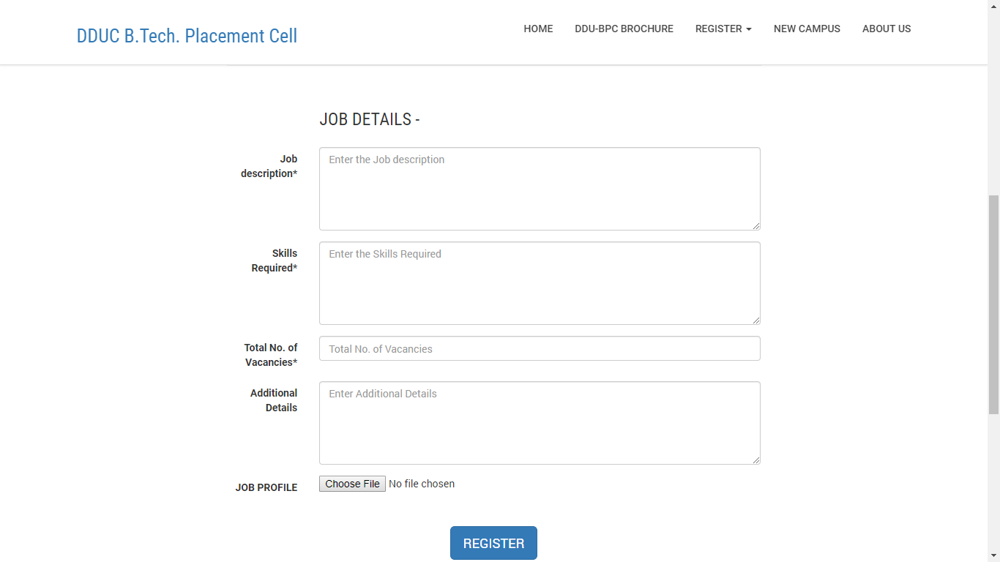
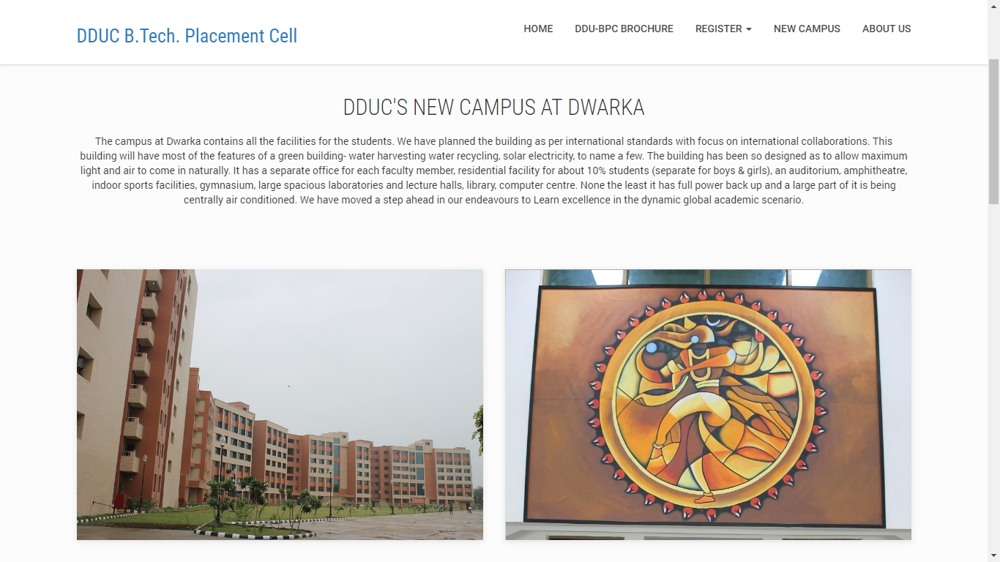
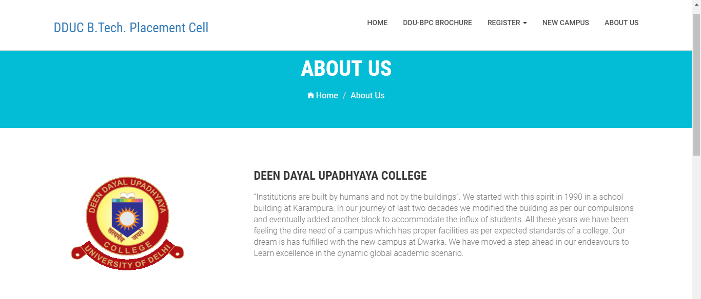
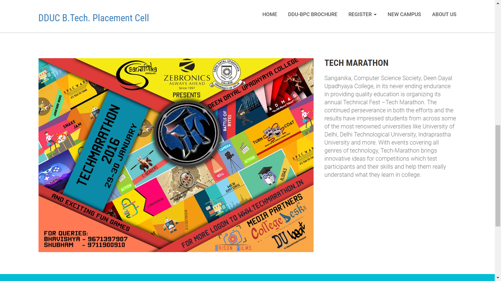

# ddubpc website

Source code for dduc btech placement cell website

## Dev

- `Trivia` - This code was made way back in Aug 2016
- `INFO` - git clone may take some time because of the large repository size - 14 MB. This is due to high resolution images and pdfs in the repo.
- For a demo serve, simply go to `src` directory and fire up a php server `php -S localhost:3000`
- For an active serve, you'll need `mysql` installed
- Then setup your database credentials in `connect.php`
- Import the database dump `ddubpc.sql` in your mysql server
- Then fire up the php server.

## Screenshots

